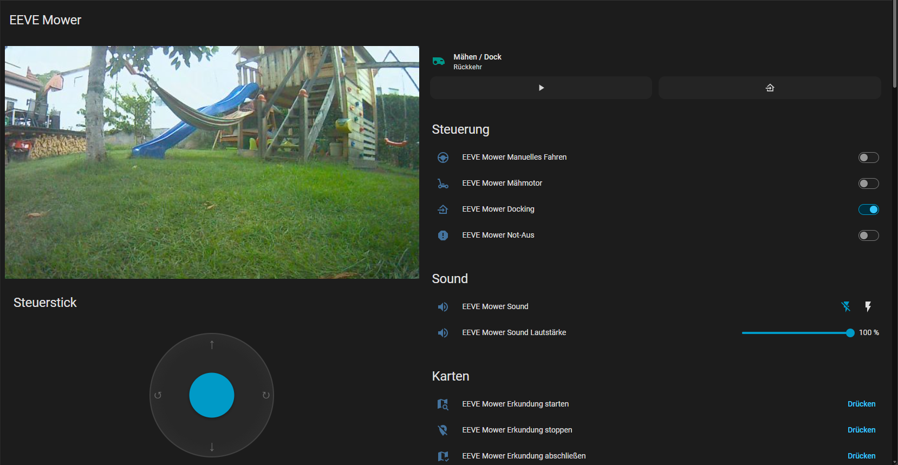

# EEVE Mower Card

A self-building Lovelace control panel for the [EEVE Mower Willow integration](https://github.com/flame4ever/eeve_mower_willow).

You just point it at your mower — the card discovers all of the mower's entities automatically and builds the full panel: live camera, joystick, lawn-mower controls, the switches (manual driving, mowing motor, docking, emergency stop), sound + volume, map exploration, system actions and all zone / global settings.



## Requirements

- The [EEVE Mower Willow integration](https://github.com/flame4ever/eeve_mower_willow) (v0.4.1+) installed and set up.

## Install (HACS)

1. HACS → three-dot menu → **Custom repositories**
2. Repository: `https://github.com/flame4ever/eeve_mower_willow_card`, category: **Dashboard** (Lovelace)
3. Install **EEVE Mower Card**, then reload your browser.

HACS registers the Lovelace resource for you. For a manual install, copy `eeve-mower-card.js` to `<config>/www/` and add it as a JavaScript-Module resource.

## Usage

Minimal — the card auto-detects your mower:

```yaml
type: custom:eeve-mower-card
```

Full options:

```yaml
type: custom:eeve-mower-card
title: EEVE Mower        # header text (optional)
device: <device_id>      # optional; auto-detected if omitted
entity: lawn_mower.xxx   # optional alternative to device
show_camera: true        # optional (default true)
show_joystick: true      # optional (default true)
show_settings: true      # optional (default true)
```

If you have **more than one** mower, set `device:` (or any one `entity:` of that mower) so the card knows which one to build.

## Add it to a dashboard (important)

The card lays out **two columns** — camera + joystick + mower tile on the left, and everything from *Steuerung / Controls* onwards on the right. To get that side‑by‑side layout, the card needs the **full width of the view**. In a normal view Home Assistant caps every card at roughly one column (~470 px), so the two columns wrap under each other even on a wide screen.

Put the card in its **own Panel view**:

1. Open your dashboard and click the **pencil** (top right) → **Edit dashboard**.
2. Add a **new view** (the **+** tab) — or edit an existing one via the **pencil on its tab**.
3. In the view dialog, under **Layout**, choose **Panel (single card)** *(German: „Panel (einzelne Karte)")*.
4. **Save**.
5. In that Panel view, add **one** card → *Manual / By YAML* → paste:

   ```yaml
   type: custom:eeve-mower-card
   ```
6. **Save**.

Result:

- **Wide screens / desktop:** camera + joystick on the left, controls on the right.
- **Phones / narrow screens:** the two columns stack automatically, everything below each other.

A Panel view shows exactly one card, which is perfect here since this single card already contains the whole control panel. If you drop the card into a normal (Sections/Masonry) view instead, it still works — it just always stacks vertically.

## How it works

The card finds the mower's device and resolves every control by its **`translation_key`** from the entity registry (e.g. `manual_driving`, `mowing_motor`, `sound`), **not** by entity‑id. That keeps it working regardless of the entity‑id prefix or the interface language — on a German install the manual‑driving switch is `switch.…_manuelles_fahren`, and the card still finds it. The joystick is bundled into this file, so no extra resource is needed.

## License

MIT
