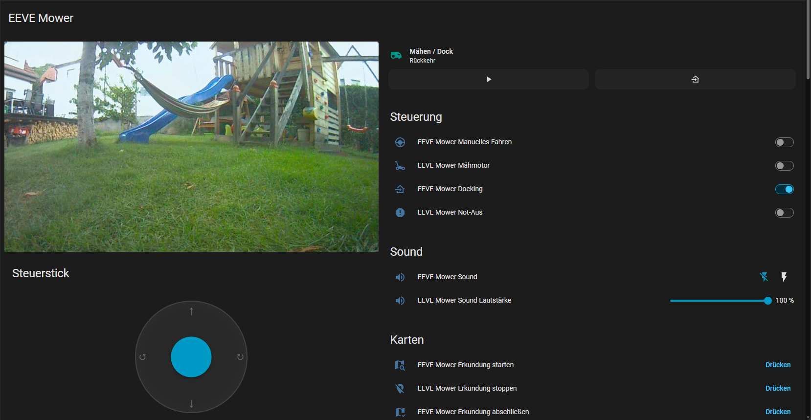

# EEVE Mower Card

Two self-building Lovelace cards for the [EEVE Mower Willow integration](https://github.com/flame4ever/eeve_mower_willow).

**`custom:eeve-mower-card`** — the full control panel. You just point it at your mower and the card discovers all of the mower's entities automatically: live camera with status overlay, joystick, lawn-mower controls, the switches (manual driving, mowing motor, docking, emergency stop), sound + volume, map exploration, system actions and all zone / global settings.

**`custom:eeve-mower-map-card`** — a satellite map of your garden showing the mowing zones and the mower's live position, with an editor for drawing, cloning and renaming zones.



## Requirements

- The [EEVE Mower Willow integration](https://github.com/flame4ever/eeve_mower_willow) (v0.5.0+) installed and set up.

## Install (HACS)

1. HACS → three-dot menu → **Custom repositories**
2. Repository: `https://github.com/flame4ever/eeve_mower_willow_card`, category: **Dashboard** (Lovelace)
3. Install **EEVE Mower Card**, then reload your browser.

HACS installs both cards and registers the Lovelace resources for you.

For a manual install, copy both `eeve-mower-card.js` and `eeve-mower-map-card.js` to `<config>/www/` and add each one as a JavaScript-Module resource (`/local/eeve-mower-card.js` and `/local/eeve-mower-map-card.js`).

## Usage

Minimal — the card auto-detects your mower:

```yaml
type: custom:eeve-mower-card
```

Full options:

```yaml
type: custom:eeve-mower-card
title: EEVE Mower        # header text (optional)
device: <device_id>      # optional; auto-detected if omitted
entity: lawn_mower.xxx   # optional alternative to device
show_camera: true        # optional (default true)
show_joystick: true      # optional (default true)
show_settings: true      # optional (default true)
```

If you have **more than one** mower, set `device:` (or any one `entity:` of that mower) so the card knows which one to build.

## Add it to a dashboard (important)

The card lays out **two columns** — camera + joystick + mower tile on the left, and everything from *Steuerung / Controls* onwards on the right. To get that side‑by‑side layout, the card needs the **full width of the view**. In a normal view Home Assistant caps every card at roughly one column (~470 px), so the two columns wrap under each other even on a wide screen.

Put the card in its **own Panel view**:

1. Open your dashboard and click the **pencil** (top right) → **Edit dashboard**.
2. Add a **new view** (the **+** tab) — or edit an existing one via the **pencil on its tab**.
3. In the view dialog, under **Layout**, choose **Panel (single card)** *(German: „Panel (einzelne Karte)")*.
4. **Save**.
5. In that Panel view, add **one** card → *Manual / By YAML* → paste:

   ```yaml
   type: custom:eeve-mower-card
   ```
6. **Save**.

Result:

- **Wide screens / desktop:** camera + joystick on the left, controls on the right.
- **Phones / narrow screens:** the two columns stack automatically, everything below each other.

A Panel view shows exactly one card, which is perfect here since this single card already contains the whole control panel. If you drop the card into a normal (Sections/Masonry) view instead, it still works — it just always stacks vertically.

## Map card

The map card shows your mowing zones on a satellite image together with the mower's live GPS position:

```yaml
type: custom:eeve-mower-map-card
title: EEVE Karte        # header text (optional)
```

Click the **pencil** in the top-right corner of the map to enter edit mode, where you can draw new zones, clone or rename existing ones and drag their corners. Saving writes the zones back to the mower via the integration's `eeve_mower_willow.save_zones` service. New or cloned zones show up as entities in Home Assistant right away — no restart needed.

## How it works

The cards find the mower's device and resolve every control by its **`translation_key`** from the entity registry (e.g. `manual_driving`, `mowing_motor`, `sound`), **not** by entity‑id. That keeps them working regardless of the entity‑id prefix or the interface language — on a German install the manual‑driving switch is `switch.…_manuelles_fahren`, and the card still finds it. The joystick and the camera overlay are bundled into `eeve-mower-card.js`, so no extra resources are needed for them.

## License

MIT
